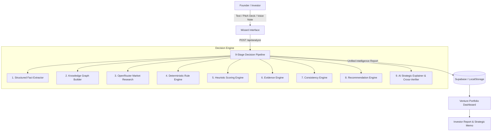

# VentureLens AI — Venture Capital & Startup Decision Intelligence Platform

[-black.svg?logo=nextdotjs)](https://nextjs.org/)
[](https://www.typescriptlang.org/)
[](https://tailwindcss.com/)
[](https://openrouter.ai/)
[](https://supabase.com/)
[](LICENSE)

**VentureLens AI** is a state-of-the-art automated venture capital decision intelligence platform designed for startup founders, venture capitalists, angel investors, and incubators. It combines deterministic heuristic rule engines with multi-provider neural reasoning to perform rigorous, non-generic evaluations of early-stage venture ideas.

---

## ⚙️ Environment & System Requirements

| Parameter | Requirement / Version |
|---|---|
| **Node.js** | `>= 20.9.0` (LTS recommended) |
| **npm** | `>= 10.0.0` |
| **Framework** | Next.js `16.2.12` (Turbopack Enabled) |
| **Language** | TypeScript `5.x` (Strict Type Safety) |
| **Deployment Target** | Vercel, Netlify, AWS Amplify, Docker, or Localhost |

### 🚀 Execution Modes (Zero-Config vs Full AI Production)

VentureLens AI is built to run out-of-the-box on any system:

| Capabilities | Zero-Config Mode (No `.env.local`) | Full AI Production Mode (With `.env.local`) |
|---|---|---|
| **Demo Pitch Evaluation** | ✅ Supported (Pre-built & Rule Engine) | ✅ Full Multi-Model AI Reasoning |
| **Pitch Deck Document Parser** | ⚠️ Fallback Text Extraction | ✅ Multimodal PDF/DOCX AI Parsing |
| **Interactive Voice Pitch Note** | ✅ Native Browser MediaRecorder | ✅ AI Speech Formatting & Structuring |
| **Market Intelligence** | ⚠️ Rule-based Competitor Matrix | ✅ Live OpenRouter AI Market Search |
| **Data Persistence** | ✅ Client LocalStorage | ✅ Supabase PostgreSQL RLS |

---

## 🌟 Core System Highlights

- 🧠 **9-Stage Decision Intelligence Pipeline**: Executes structured entity extraction, knowledge graph synthesis, 16 logic checks, heuristic scoring, competitor search, and strategic AI cross-verification.
- 📄 **Multimodal Pitch Deck Parser**: Reads and extracts full venture specifications from `.pdf`, `.docx`, `.doc`, `.txt`, and `.md` pitch decks automatically using AI.
- 🎙️ **Interactive Voice Pitch Note**: Built-in dual MediaRecorder and Web Speech API engine that captures spoken voice pitches, removes filler words ("um", "uh"), and populates venture parameters in real time.
- 🔍 **Real-World OpenRouter Market Research**: Performs context-aware competitive research, identifying incumbents, TAM benchmarks, and sector growth vectors without hallucinated fallbacks.
- 📊 **Dynamic Heuristic Scoring**: Evaluates 10 distinct venture dimensions with realistic score distributions (no static template scores).
- 📈 **Investor Memos & GTM Roadmaps**: Generates YC/Sequoia-grade SWOT analysis, 90-day execution roadmaps, and landing page copy.

---

## 🏗️ System Architecture



---

## 📂 Repository Organization

```
Venturelens/
├── src/
│   ├── app/                      # Next.js App Router
│   │   ├── api/                  # Production API Routes
│   │   │   ├── analyze/          # Main 9-stage analysis pipeline
│   │   │   ├── parse-document/   # Pitch Deck PDF/DOCX AI parser
│   │   │   ├── format-voice/     # Voice speech-to-text pitch structurer
│   │   │   ├── projects/         # Project persistence API
│   │   │   └── reports/          # Report retrieval API
│   │   ├── dashboard/            # Venture Portfolio Dashboard
│   │   ├── wizard/               # Multi-step Evaluation Wizard
│   │   ├── report/[id]/          # Interactive Report & Memo View
│   │   ├── templates/            # Sector Startup Evaluation Templates
│   │   ├── platform/             # Architecture & API documentation
│   │   └── features/             # System feature deep-dives
│   ├── lib/
│   │   └── engines/              # Core Evaluation Engines
│   │       ├── ai-provider.ts    # Multi-provider OpenRouter/Gemini Engine
│   │       ├── scoring-engine.ts # Dynamic 10-dimension scoring engine
│   │       ├── external-research.ts # OpenRouter AI market intelligence
│   │       └── ai-explainer.ts   # Dynamic SWOT & cross-verifier
│   ├── stores/                   # Zustand state management
│   └── types/                    # TypeScript interfaces & report schemas
├── supabase/                     # PostgreSQL migrations & schema definition
├── LICENSE                       # MIT License
└── package.json                  # Project dependencies & scripts
```

---

## ⚡ Quick Start

### 1. Clone & Install Dependencies

```bash
git clone https://github.com/dathasaiswaroopgudimella-png/Venturelens.git
cd Venturelens
npm install
```

### 2. Configure Environment Variables (Optional)

Create `.env.local` based on `.env.example`:

```env
# AI Providers
OPENROUTER_API_KEY=sk-or-v1-...
GEMINI_API_KEY=...

# Database (Optional for guest mode)
NEXT_PUBLIC_SUPABASE_URL=...
NEXT_PUBLIC_SUPABASE_ANON_KEY=...
```

### 3. Run Locally

```bash
npm run dev
```

Open [http://localhost:3000](http://localhost:3000) in your browser.

---

## 📜 License

This project is open-source software licensed under the [MIT License](LICENSE).
