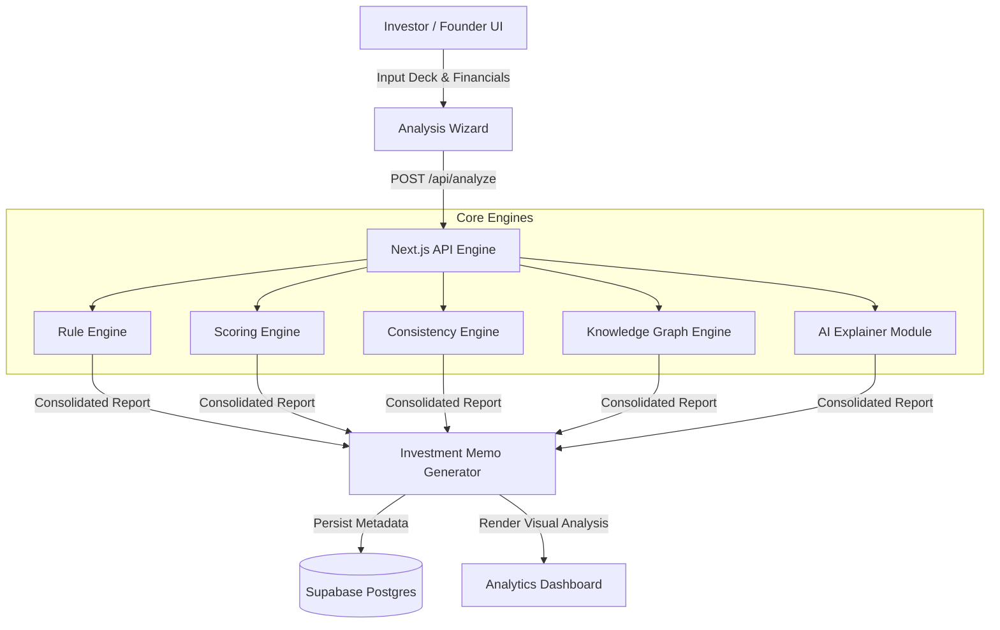

# Venturelens — AI-Powered VC & Startup Intelligence Engine

[](https://nextjs.org/)
[](https://www.typescriptlang.org/)
[](https://tailwindcss.com/)
[](https://supabase.com/)
[](LICENSE)

**Venturelens** is an automated venture capital analytics platform engineered for investors, incubators, and startup founders. It leverages deterministic rule engines, structured AI explainers, and real-time knowledge graphs to calculate startup defensibility, market alignment, unit economics, and investment risk profiles.

---

## Core Capabilities

- **Multi-Engine Evaluation Pipeline**: Combines scoring engines, consistency verifiers, rule engines, and structured AI extractors.
- **Interactive Investment Wizard**: Step-by-step evaluation workflow for startup pitch decks, financials, and team profiles.
- **Knowledge Graph Synthesis**: Maps founder expertise, market TAM/SAM, competitive moats, and valuation metrics.
- **Comprehensive Reporting Dashboard**: Generates investor-grade PDF/UI evaluation reports with risk radar charts and actionable recommendations.
- **Supabase Row-Level Security**: Enterprise-grade persistence layer enforcing strict access control policies.

---

## System Architecture



---

## Repository Structure

```
Venturelens/
├── src/
│   ├── app/                # Next.js App Router (pages, layouts, API routes)
│   ├── lib/
│   │   └── engines/        # Deterministic scoring, rule & AI explainer engines
│   ├── stores/             # Zustand state management
│   ├── types/              # TypeScript interface definitions & schemas
│   └── utils/
│       └── supabase/       # Supabase client, server, and middleware helpers
├── supabase/               # PostgreSQL schema & security migrations
├── public/                 # Static assets & vectors
├── LICENSE                 # MIT License
├── package.json            # Node project configuration
└── .github/workflows/ci.yml # GitHub Actions CI workflow
```

---

## Quick Start

### 1. Installation

```bash
git clone https://github.com/dathasaiswaroopgudimella-png/Venturelens.git
cd Venturelens
npm install
```

### 2. Environment Configuration

Copy `.env.example` to `.env.local`:

```bash
cp .env.example .env.local
```

### 3. Start Development Server

```bash
npm run dev
```
Open `http://localhost:3000` to access the application interface.

---

## License

This repository is distributed under the [MIT License](LICENSE).
